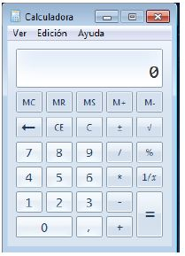
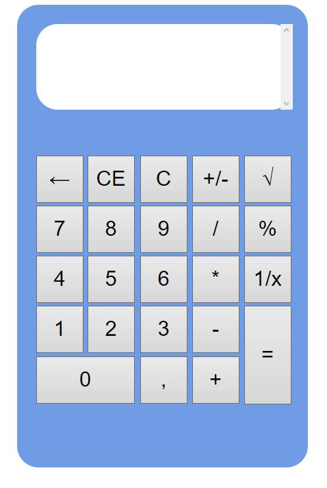
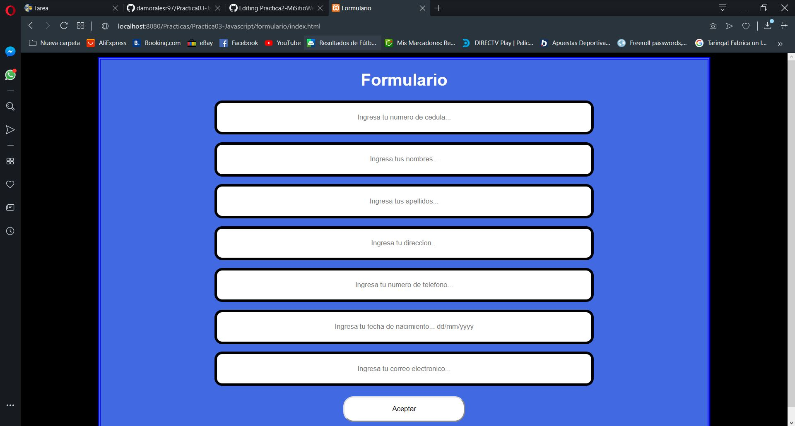
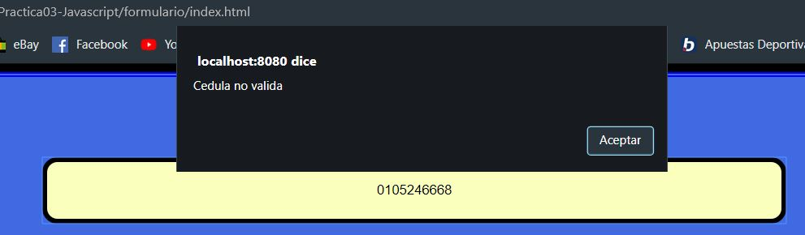
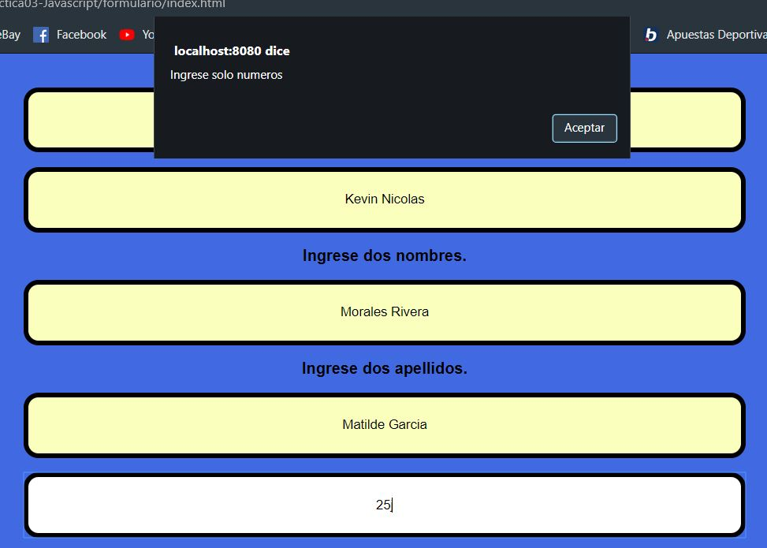
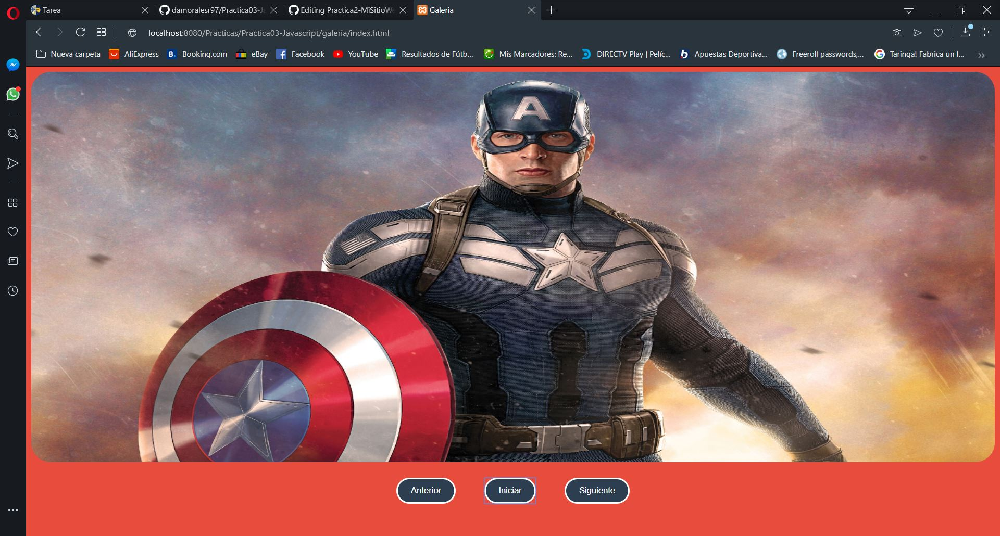

## A partir de los siguientes problemas se pide implementar soluciones basadas en el lenguaje de programación de JavaScript usando funciones y eventos. 
## 1. Se pide construir una calculadora en el lenguaje de programación de JavaScript con base a un formulario HTML usando botones y una caja de texto. Además, para que permita realizar operaciones aritméticas de complejidad básica, como: suma, resta, multiplicación, división, raíz cuadrada, entre otros. A continuación, se muestra un ejemplo de las operaciones que debe realizar la calculadora 

## 2. Diseñar una interfaz en HTML que permita ingresar los siguientes campos en un formulario: cedula, nombres, apellidos, dirección, teléfono, fecha de nacimiento y correo electrónico. Luego, usando funciones de JavaScript se debe validar que todos los campos han sido ingresados, además; que los valores ingresados en cada campo del formulario sean correctos teniendo en cuenta las siguientes condiciones: 

- Se debe validar qué, en el campo de la cedula, se ingrese sólo número y que la misma sea correcta, en base, al último dígito verificador. 
 
- Se debe validar qué, en el campo del nombres, ingrese únicamente dos nombres y que permita ingresar sólo letras. 

- Se debe validar qué, en el campo del apellidos, ingrese únicamente dos apellidos y que permita ingresar sólo letras. 

- Se debe validar qué, en el campo del teléfono, permita ingresar sólo números. 

- Se debe validar que la fecha de nacimiento ingrese en el formato dd/mm/yyyy. 

- Se debe validar qué, en el campo correo electrónico, permita ingresar un correo válido. Se considera un correo válido, cuando comienza por tres o más valores alfanuméricos, luego un @, seguido por la extensión “ups.edu.ec” o “est.ups.edu.ec”. 

## Indicaciones: 
- Para realizar las validaciones de solo letras, o sólo números. Se las debe realizar en tiempo real, es decir, a medida que el usuario escribe en el campo. 
- Todos los campos de entrada dentro del formulario deben de ser de tipo “text”. 
- Las demás validaciones se realizarán al momento de “enviar” (submit) la información del formulario hacia una página php. Si no cumple las validaciones, se mostrará un mensaje debajo de cada campo con el error y se pintara el campo con un borde rojo que representará que el campo tiene un error. Si se cumple las validaciones, se enviará a una página php, en donde se mostrará únicamente un mensaje que diga “Bienvenido, pasaste las validaciones!”. 

## 3. Diseñar una interfaz en html que tenga tres botones que diga “Anterior”, “Iniciar”, “Siguiente”, y una imagen. Luego, desde javascript se debe controlar para al hacer clic sobre uno de los botones realice una acción relacionada a una galería de imágenes (ver ejemplo, https://gihp4c.blog.ups.edu.ec/) 
## Indicaciones: 
- Se debe tener, un arreglo con los nombres de diez imágenes, previamente descargadas y almacenadas en una carpeta llamada “images”. 
- La galería de imágenes debe visualizar exclusivamente 5 imágenes. 
- Cada vez que se haga clic en le botón iniciar se deben escoger de manera aleatoria cinco imágenes de las diez que se mostrarán en la galería de imágenes. 

- Al hacer clic en el botón siguiente y haber llegado a la última imagen disponible, el botón siguiente deberá ser deshabilitado (sólo cuando se ha llegado a la última imagen el botón siguiente deberá estar deshabilitado) 
- Al hacer clic en el botón anterior y haber llegado a la primera imagen disponible, el botón anterior deberá ser deshabilitado (sólo cuando se ha llegado a la última imagen y cuando se inicie la galería de imágenes el botón anterior deberá estar deshabilitado) 

## Conclusiones
- Javascript es de gran ayuda al momento de verificar información, o también, para restringir a los usuarios la información que van a colocar en la pagina web.
- Todas las acciones que Javascript realiza, lo hace en el nivel del cliente, esto hace que no se este consultando al servidor a cada instante. Con esto ganamos eficacia en nuestras paginas web.

## GitHub
## Usuario: 
damoralesr97
## URL: 
https://github.com/damoralesr97/Practica03-Javascript
